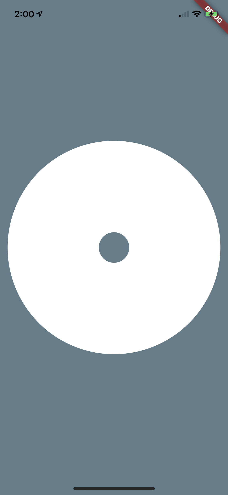
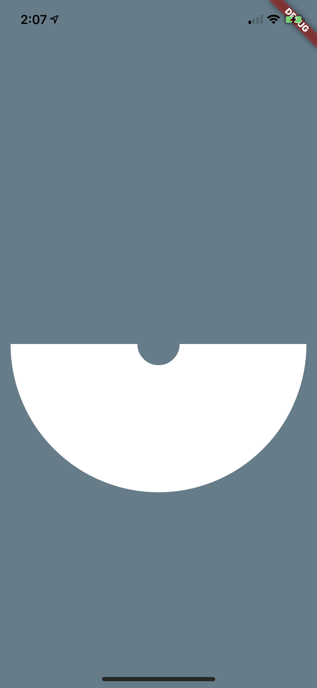

# Trim Path Bug

This example shows a bug which occurs when rendering short paths with wide stroke widths. This can occur when animating trim path values in Flare. This example is implemented in pure Flutter with no dependencies to expose the underlying issue.

## Draw Circle


The example uses a simple renderer defined in example_renderer.dart, which is used by a LeafRenderWidget. We started off by making this renderer just draw a circle.

```dart
    Path path = Path();
    path.addOval(
      Rect.fromCenter(
        center: Offset(offset.dx + size.width / 2, offset.dy + size.height / 2),
        width: 200,
        height: 200,
      ),
    );

    canvas.drawPath(
        path,
        Paint()
          ..style = PaintingStyle.stroke
          ..strokeWidth = 150
          ..color = const Color.fromRGBO(255, 255, 255, 1));
```
<br/>

## Trim Circle

Then we make it trim the circle's path in half (just to show how trimming works):

```dart
   Path path = Path();
    path.addOval(
      Rect.fromCenter(
        center: Offset(offset.dx + size.width / 2, offset.dy + size.height / 2),
        width: 200,
        height: 200,
      ),
    );

    // Trim by computing metrics...
    PathMetrics metrics = path.computeMetrics();
	PathMetric metric = metrics.first;
	// ... and then extracting the path.
    Path trimmedPath = metric.extractPath(0, metric.length / 2);

    canvas.drawPath(
        trimmedPath,
        Paint()
          ..style = PaintingStyle.stroke
          ..strokeWidth = 150
          ..color = const Color.fromRGBO(255, 255, 255, 1));
```

## Glitch with Trim Circle

Finally, you can see the glitch by replacing ```metric.length / 2``` with very short length path (0, 0.00002)

```dart
    Path trimmedPath = metric.extractPath(0, 0.00002);
```